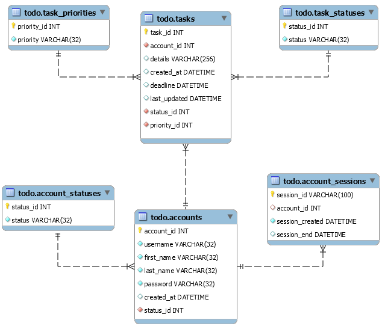

# todowebapp
## Table of Contents
[Introduction](https://github.com/faimoh/todowebapp#todowebapp)

[Technologies Used](https://github.com/faimoh/todowebapp#technologies-used)

[Requirements Analysis](https://github.com/faimoh/todowebapp#requirements-analysis)

[Data Model](https://github.com/faimoh/todowebapp#data-model)

[Application Architecture](https://github.com/faimoh/todowebapp#application-architecture)

  * [Data Layer](https://github.com/faimoh/todowebapp#data-layer)

  * [Controllers](https://github.com/faimoh/todowebapp#controllers)

  * [Action Handlers](https://github.com/faimoh/todowebapp#action-handlers)

  * [Views](https://github.com/faimoh/todowebapp#views)
  
[Results](https://github.com/faimoh/todowebapp#results)

## Introduction
A Java based web application for ToDo activities. Through this web application, one can create, read and update their todos through a modern web browser. The application also implements AAA, which means every user has their own account and their todo list etc. are private to them.

This document is not for the newbies. You must possess good knowledge of below technologies to understand this document and the related application:
1. Java
2. OOA&D
3. SQL, RDBMS
4. HTML
5. HTTP
6. Servlet, JSP
7. Tomcat


## Technologies Used
Java  
Servlet, JSP  
Apache Tomcat  
MySQL  
HTML   
Apache NetBeans IDE   
Firefox

This is entirely a back-end project. So, front-end technologies like CSS, JavaScript are not used. The aim of the project is to effectively learn and showcase how different pieces of the Java Servlet API work together.

We shall develop the web application starting with requirements analysis. Then we shall move on to database design. Data is central to any web application. Almost all use cases deal with data. Once the web application's data model is ready, we shall then move on to design the architecture of the application. In this phase, we shall see how our application behaves to different HTTP actions. Because, all actions performed by the application's users are through HTTP. We shall think of all possible user actions and define them clearly. Next, we shall move on to designing the interfaces and classes.

## Requirements Analysis
For our application, we begin with defining what a todo is for us. A todo is a task that must be accomplished. We create list of such tasks to help us live a prdocutive life. We keep tracking the list as we get the tasks done one after the other. A todo item for us has below properties:
1. an unique identification number such as a positive number
2. details of the task that we want to accomplish
3. task created timestamp
4. task status

Initially, a task will have the status 'todo'. When we start working on it, we change it to 'in progress'. Once the task gets accomplished, we mark its status as 'done'.

We want our application to also support multiple users. And every user shall have their own private list. Thus, users cannot see others' todo list. A user shall be identified by their username, which is their valid email address for us. Users are given accounts on our application. Thus, an account has below properties:
1. an unique account identification number such as a positive integer
2. a distince username, which is an email address. Duplicate email addresses are not allowed.
3. user's first name. Duplicates are allowed.
4. user's last name. Duplicates are allowed.
5. password. Duplicates are allowed.
6. created_at - the exact timestamp the account was created in the database.
7. account status - enabled/disabled. Only enabled user accounts will be able to login the application.

We want an 'administrator' account to only manage accounts. The administrator account shall use the username 'admin'. The admin user can:
1. create a user account
2. help reset password in case someone forgets
3. can enable or disable a user account
4. not disable 'admin' account
5. change user details
6. not have access to any user's todo lists
7. not maintain a personal todo list

The last two items are worth observing. Usually, it is believed that a user with 'admin' rights has access to everybody's information. We don't want such. Also, we have already defined that 'admin' account for us is only to manage accounts. It is not for managing todo lists of users. 'admin' user account is not often used. It is meant only for special purposes. For our application, we expect one user account to also handle 'admin' account. So, it will be the same person who logs in using 'admin' credentials only when required. Because it is an existing user account using 'admin' account only to manage all accounts, we don't want a separate task list for admin account. That doesn't serve any purpose.

We want the todo lists to persist always. Which means, once a todo item is created successfully by a user, it can never be deleted. Similarly, we also don't want to delete a user account. In conclusion, we don't want to support 'delete' operations in our application. Thus, we only support CRU out of CRUD.

Because, we want our application to maintain private todo lists, we want the application to provide login and logout mechanisms. This is called 'authentication'. Every user, including 'admin', should first authenticate themselves. Upon successful authentication, a user will be redirected to their workspace. Because we are discussing two types of users (one admin and the other normal), we shall have two types of workspaces on our application. An admin user shall be only working with user account management workspace. A normal user shall be only working with todo list management workspace. Both are exclusive. A normal user cannot see admin's workspace. And admin user cannot see normal user's workspace. This is called 'authorization'.

In addition to the above requirements, we want our application to store the details of users' login and logout timestamps. Through this we are tracking users' activity on our application. This is not exactly 'accounting' from AAA, but for our application this serves the purpose of calling it as 'accounting'.

## Data Model
Based on the requirements that we have collected so far, we understand that we have to store data for below entities of the application:
1. account
2. task

Example data for few accounts:
|Account ID|Username|First Name|Last Name|Password|Created At|Status|
|---|---|---|---|---|---|---|
|1|admin|Administrator|User|password|2020-05-06 17:34:04|enabled|
|2|john[]()@example.com|John|Johnsson|oneword|2020-05-07 12:34:04|disabled|
|3|eric[]()@example.com|Eric|Ericsson|twoword|2020-05-08 13:34:04|enabled|
|4|ana[]()@example.com|Ana|Mary|threeword|2020-05-09 11:34:04|enabled|

We see that account statuses are repeated throughout the table. So, as part of database normalization, it's better to put the repeated data in a separate table. There's some good reason behind. Let's say, we have 100 users. And we want to replace the words enabled and disabled with 1 and 2 respectively. We have to modify the status column of all rows of the table. Imagine how cumbersome it will be to do such modification for a table with thousands of rows! Database normalization at rescue, thankfully!

After normalization, we shall have two tables - account_statuses and accounts:

**ACCOUNT_STATUSES**
|ID|Status|
|---|---|
|1|enabled|
|2|disabled|

**ACCOUNTS**
|Account ID|Username|First Name|Last Name|Password|Status ID|
|---|---|---|---|---|---|
|1|admin|Administrator|User|password|1|
|2|john[]()@example.com|John|Johnsson|oneword|2|
|3|eric[]()@example.com|Eric|Ericsson|twoword|1|
|4|ana[]()@example.com|Ana|Mary|threeword|2|

Similarly, we shall have three tables for tasks - task_statuses, task_priorities and tasks: 

**TASK_STATUSES**
|ID|Status|
|---|---|
|1|todo|
|2|in progress|
|3|done|

**TASK_PRIORITIES**
|ID|Priority|
|---|---|
|1|important & urgent|
|2|important but not urgent|
|3|not important but urgent|
|4|not important and not urgent|

**TASKS**
|<sub>Task ID</sub>|<sub>Account ID</sub>|<sub>Details</sub>|<sub>Created At</sub>|<sub>Deadline</sub>|<sub>Last Updated</sub>|<sub>Status ID</sub>|<sub>Priority ID</sub>|
|---|---|---|---|---|---|---|---|
|<sub>1</sub>|<sub>2</sub>|<sub>Buy pencils.</sub>|<sub>2019-05-06 17:40:03</sub>|<sub>2019-05-07 17:40:03</sub>| |<sub>2|<sub>1|
|<sub>2|<sub>3</sub>|<sub>Buy books.</sub>|<sub>2019-05-07 7:40:03</sub>|<sub>2019-05-07 17:40:03</sub>|<sub>2019-05-07 23:40:03</sub>|<sub>2</sub>|<sub>1</sub>|

Finally, we also have another requirement to store account session data. We shall store it as shown in below table:

**ACCOUNT_SESSIONS**
|Session ID|Account ID|Session Created|Session End|
|---|---|---|---|
|asd1gh|1|2019-05-06 17:40:03|2019-05-06 18:00:03|

Normally, in enterprise applications IDs are not stored as integers. Because it will be easier for someone to query others information by just using an integer! In real world applications, IDs are not numeric but alphanumeric, with upto 100 characters. Thus, making it impossible for someone to guess another ID!

We shall call our database as 'todo' in MySQL. And here's the data model built based on the above information:


## Application Architecture
We shall develop this application following the famous and widely used MVC 2 desgin pattern. Our application will be action based. When a user sends a HTTP request to our application, we translate it to corresponding action on our application. The actions we support are create, read and update (CRU). Our application essentially is a data driven. It facilitates actions on the database. It helps users to store and manage their data on a remote database securely and safely with the help of authentication and authorization mechanisms. It acts as an HTML and HTTP based interface to the database.

When a user makes a HTTP request to our application, we send back requested data in the form of HTML. HTML supports links and forms to help users interact with web applications. Links are used to retrieve/get (HTTP GET) information, while forms are used to post data (HTTP POST) to the web application.

So, here's how we are going to translate HTTP requests to actions:

| HTML Element | HTTP Method   | Application Action  |
| :------------ |:-------------|:---------|
| Hyperlink | HTTP GET      | Read details |
| Form | HTTP POST     | Create or update |

HTTP GET sends the data as query parameters to the URL. While, HTTP POST sends the data in HTTP request body. HTTP POST doesn't reveal the data through the URL, whereas HTTP GET does. So, HTTP GET is not suitable for sending login credentials. Nobody wants to see their username and password appended to the HTTP request URL! We shall use HTTP POST to send user's credentials while logging in.

So, far we have decided how we are going to use HTTP, HTML and a database. There's another concept of HTTP that's essential for us to understand to decide the architecture of our HTTP based application. That's URL - uniform resource locator. Here's an example URL of a web application called 'webapp' hosted on example.com server:

`http://www.example.com/webapp/details?id=12`

In the above example URL, 'http' is the protocol, `www.example.com` is the domain name or server name, 'webapp' is the application context deployed on the server and 'details' is the application that we are sending our HTTP request for. 'id' is the query parameter that we are passing to the 'details' with a value of '12'. Query parameters provide us with a mechanism to pass parameters to the web application and receive related content back in response from the web application. For example, imagine a weather application running on a web server. Instead of providing us with the list of weather reports of all locations, we can send our choice of location as a query parameter to the web application. The application would then send in response the weather details of our choice of location.

A web application runs on the web server, unlike applications that are run on our PCs. A Java application running on a web server is called as a Servlet. Servlets emulate the web applications. They run inside a container. Apache Tomcat is a popular example of such a container. The container software translates the raw HTTP requests and responses into Java objects and provides them for servlets. A static website serves the same content for every HTTP request. But, a servlet can generate dynamic content that is distinct for every HTTP request made.

The todo web app that we are building will contain multiple parts - servlets, filters, jsp files, database classes, POJOs etc. We shall put them all together (like bundling them) under one application context (or application environment) on the container (Tomcat). We shall call this application context as 'todo'. So, if we are running Tomcat on our PC at port 8080, our application context 'todo' can be accessed through the URL:

`http://localhost:8080/todo/`

### Data Layer
Our data layer consists of an implementation of DAO pattern and factory pattern on top of JDBC datasource. We choose JDBC datasource instead of drivermanager because we want to reap the benefits of connection pooling.
### Controllers
We just have one servlet serving as the **Controller**, called 'Main'. A user's HTTP request is an action for us. So, the purpose of our controller servlet is to just choose an appropriate action for the HTTP request made. The controller servlet chooses an action handler and hands it over the request made by the user. We don't write the action execution steps in our controller. We keep it clean and lean. Its purpose is to 'choose' an action handler. Not to 'execute' the action by itself. After the action handler executes the requested action, the controller receives the 'next step' to be performed as a response from the action handler. Controller's job is to simply pick the resource that performs the requested response. In conclusion, we keep our controller away from all the business logic.

We shall map our controller servlet to the URI pattern `/app/*`. So, our controller servlet will handle every URI that follows the pattern `/app/`. 

### Action Handlers
An action requested by a user is the business logic for our application. Action handlers are the **Model** in our MVC implementation. Every action has to implement Action interface:

```java
public interface Action {

    /*
    An action is supposed to execute and return results. ActionResponse represents the response.
    */
    public abstract ActionResponse execute(HttpServletRequest request, HttpServletResponse response)
            throws Exception;
}
```
An action is supposed to execute and return results. We create a special class for such result - ActionResponse. An action handler can choose to 'forward' or 'redirect'.

```java
public class ActionResponse {
    private String method;
    private String viewPath;

    public ActionResponse() {
        this.method = "";
        this.viewPath = "";
    }

    public void setMethod(String method) {
        this.method = method;
    }

    public String getMethod() {
        return this.method;
    }

    public void setViewPath(String viewPath) {
        this.viewPath = viewPath;
    }

    public String getViewPath() {
        return this.viewPath;
    }

    @Override
    public String toString() {
        return this.getClass().getName()+"["+this.method+":"+this.viewPath+"]";
    }
}
```
We implement the factory design pattern. We create a factory class - ActionFactory - to give us the action handler class we require:
```java
public class ActionFactory {
    private static Map<String, Action> actions = new HashMap<String, Action>() {
        {
            put(new String("POST/login"), new LoginAction());
            put(new String("GET/login"), new LoginAction());
            put(new String("GET/logout"), new LogoutAction());
            put(new String("GET/admin/accounts/dashboard"), new AdminAccountsDashboardAction());
            put(new String("GET/admin/accounts/new"), new AdminNewAccountFormAction());
            put(new String("POST/admin/accounts/create"), new AdminCreateAccountAction());
            put(new String("GET/admin/accounts/details"), new AdminReadAccountDetailsAction());
            put(new String("POST/admin/accounts/update"), new AdminUpdateAccountAction());
            put(new String("GET/tasks/dashboard"), new UserTasksDashboardAction());
            put(new String("GET/tasks/new"), new UserNewTaskFormAction());
            put(new String("GET/tasks/details"), new UserReadTaskDetailsAction());
            put(new String("POST/tasks/create"), new UserCreateTaskAction());
            put(new String("POST/tasks/update"), new UserUpdateTaskAction());
            put(new String("GET/users/profile"), new UserReadProfileAction());
            put(new String("POST/users/update"), new UserUpdateProfileAction());
        }
    ;
    };

    public static Action getAction(HttpServletRequest request) {
        Action action = actions.get(request.getMethod() + request.getPathInfo());
        if (action == null) {
            return new UnknownAction();
        } else {
            return action;
        }
    }
}
```
The purpose of our controller servlet is to:
1. select an appropriate action handler (model or business logic) and pass it the HTTP request object
2. ask the action handler to execute and take its response
3. select the view component decided by the action handler and pass it the HTTP request object

```java
 protected void processRequest(HttpServletRequest request, HttpServletResponse response)
            throws ServletException, IOException {
        Action action = ActionFactory.getAction(request);
        try {
            ActionResponse actionResponse = action.execute(request, response);
            if (actionResponse.getMethod().equalsIgnoreCase("forward")) {
                System.out.println(this.getClass().getCanonicalName() + ":forward:" + actionResponse);
                this.getServletContext().getRequestDispatcher(actionResponse.getViewPath()).forward(request, response);
            } else if (actionResponse.getMethod().equalsIgnoreCase("redirect")) {
                System.out.println(this.getClass().getCanonicalName() + ":redirect:" + actionResponse);
                if (actionResponse.getViewPath().equals(request.getContextPath())) {
                    response.setHeader("Cache-Control", "no-cache, no-store, must-revalidate");
                    response.setHeader("Pragma", "no-cache");
                    response.setDateHeader("Expires", 0);
                }
                response.sendRedirect(actionResponse.getViewPath());
            } else if (actionResponse.getMethod().equalsIgnoreCase("error")) {
                System.out.println(this.getClass().getCanonicalName() + ":error:" + actionResponse);
                response.sendError(401);
            } else {
                System.out.println(this.getClass().getCanonicalName() + ":" + actionResponse);
                response.sendRedirect(request.getContextPath());
            }
        } catch (Exception e) {
            e.printStackTrace();
        }
    }    
```
    
The table below shows list of HTTP requests our application responds to and their associated action handlers:
|User's Intended Action|HTTP Request URI|Action Handler|
|---|---|---|
|Submit empty login credentials|`GET /app/login`|LoginAction|
|Submit login credentials|`POST /app/login`|LoginAction|
|Get accounts dashboard|`GET /app/admin/accounts/dashboard`|AdminAccountsDashboardAction|
|Get new account form|`GET /app/admin/accounts/new`|AdminNewAccountFormAction|
|Submit new account details|`POST /app/admin/accounts/create`|AdminCreateAccountAction|
|Get details of an account|`GET /app/admin/accounts/details?id=xx`|AdminReadAccountDetailsAction|
|Update details of an account|`POST /app/admin/accounts/update`|AdminUpdateAccountAction|
|Get tasks dashboard|`GET /app/tasks/dashboard`|UserTasksDashboardAction|
|Get new task form|`GET /app/tasks/new`|UserNewTaskFormAction|
|Submit new task details|`POST /app/tasks/create`|UserCreateTaskAction|
|Get details of a task|`GET /app/tasks/details?id=xx`|UserReadTaskDetailsAction|
|Update details of a task|`POST /app/tasks/update`|UserUpdateTaskAction|
|Get details of my profile|`GET /app/users/profile`|UserReadProfileAction|
|Update my profile details|`POST /app/users/update`|UserUpdateProfileAction|
|Logout|`GET /app/logout`|LogoutAction|

### Views
The job of an action handler is to execute the business logic and choose an appropriate **View** component as a response to the request made by an user. The table below shows all action handlers and their view components:
|Action Handler|View Component|
|---|---|
|LoginAction|`/WEB-INF/pages/admin/accounts/dashboard.jsp` <br> `/WEB-INF/pages/tasks/dashboard.jsp`|
|AdminAccountsDashboardAction|`/WEB-INF/pages/admin/accounts/dashboard.jsp`|
|AdminNewAccountFormAction|`/WEB-INF/pages/admin/accounts/newAccount.jsp`|
|AdminCreateAccountAction|`/WEB-INF/pages/admin/accounts/createAccountResult.jsp`|
|AdminReadAccountDetailsAction|`/WEB-INF/pages/admin/accounts/accountDetails.jsp`|
|AdminUpdateAccountAction|`/WEB-INF/pages/admin/accounts/updateAccountResult.jsp`|
|UserTasksDashboardAction|`/WEB-INF/pages/tasks/dashboard.jsp`|
|UserNewTaskFormAction|`/WEB-INF/pages/tasks/newTask.jsp`|
|UserCreateTaskAction|`/WEB-INF/pages/tasks/createTaskResult.jsp`|
|UserReadTaskDetailsAction|`/WEB-INF/pages/tasks/taskDetails.jsp`|
|UserUpdateTaskAction|`/WEB-INF/pages/tasks/updateTaskResult.jsp`|
|UserReadProfileAction|`/WEB-INF/pages/users/viewProfile.jsp`|
|UserUpdateProfileAction|`/WEB-INF/pages/users/updateProfileResult.jsp`|
|UnknownAction|`/WEB-INF/pages/users/unknownAction.jsp`|

The view component builds the required HTML response that will be sent to the the user. View component reads the messages set by the action handler and shows it to the user.
### Filters
We use filters to intercept incoming HTTP requests. All the filters will be used before the request is passed to the controller servlet. Any incoming HTTP request will be first handled by authentication filter. Through this filter we check if the user is already logged in or not. If not logged in, we redirect the user to login page. After successfully passing through the authentication filter, the HTTP request will get intercepted by two more filters. In these filters we check the URI path and the user is 'admin' or normal user. If a normal user is trying to access 'admin' URI paths, we prevent such access. If 'admin' user is trying to access tasks related URI paths, we prevent such access.

Only 'admin' can access the URIs beginning with `/app/admin/*` and only normal user can access the URIs beginning with `/app/tasks/*`. Other URIs `/app/login`, `/app/logout`, `/app/users/*` can be accessed by both.

We don't intercept responses that we send out.

## Results
So, here's how our application looks:
